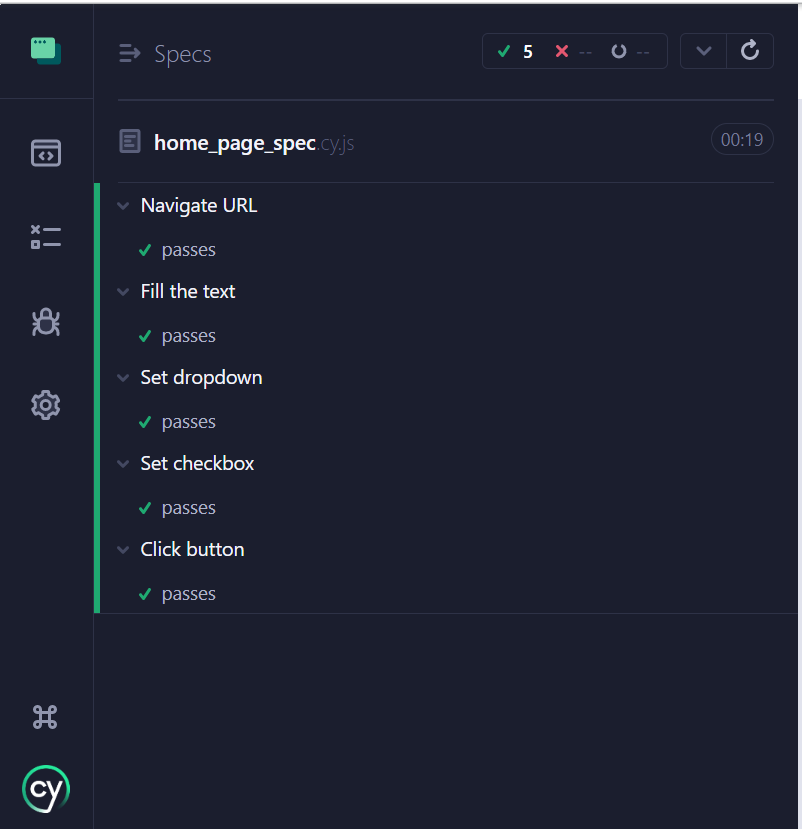

## Install Cypress
- https://docs.cypress.io/guides/getting-started/installing-cypress

## Intelligent Code Completion
- Add the following to jsconfig.json to get auto suggestion in vscode

               {
                 "include": [
                     "./node_modules/cypress",
                     "cypress/**/*.js"
                             ]
               }

## How to use xpath in cypress
- Go to the support file and add the following to use xpath while writing tests

            require('@cypress/xpath');
            
- Once, you have the above saved in support file, you can use xpath in your favourite editor.

## Test Output

## TODO

CI/CD Integration
